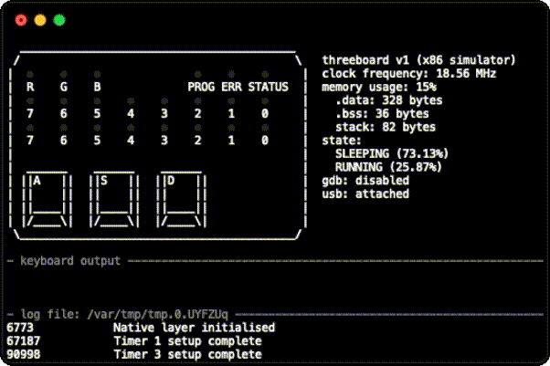

# threeboard 

threeboard is a fully-functional mechanical USB keyboard with only three keys! However it can do just as much as the keyboard you currently have on your desk.

Unlike a traditional keyboard, characters don't show up on the screen after each threeboard keypress, because there aren't enough keys. Instead, combinations of the three keys are used to specify key and modifier codes on two built-in 8-bit LED binary indicators. This can then be sent to the host computer as USB keycodes. The threeboard is programmable and supports multiple layers; layers allow programming and storing macros into the threeboards storage for later retrieval. All functionality is documented in the [threeboard user manual](documentation/threeboard/threeboard_user_manual.md).

## Overview

Threeboard is a self-contained hardware and firmware project built from scratch, with no external dependencies. This means that all components, from the USB stack to the PCB hardware designs, are written from the ground and are all contained in this repository.

This repository also contains extensive documentation, both within the firmware and in a set of markdown documentation. The primary design goal of the C++ firmware code is readability. It's extensively tested, including end-to-end integration tests which run the complete firmware in a hardware simulator to emulate the physical hardware.

## How to try it out

The threeboard project includes a terminal-based graphical firmware simulator capable of simulating the entire functionality of the threeboard. You can build and run the simulator yourself by reading the [simulator build instructions](documentation/threeboard/simulator_build_instructions.md). The simulator is built on top of the [simavr](https://github.com/buserror/simavr) AVR simulator, and runs the exact same firmware file that gets flashed to physical hardware. The simulator also allows remote debugging with GDB, so you can step through the threeboard firmware as it's being simulated to learn about it or investigate bugs!

Building your own physical threeboard requires a physical threeboard PCB, soldering tools and components, as well as some knowledge of electronics and soldering. If you're interested in building one, check out the [threeboard hardware build instructions](documentation/threeboard/hardware_build_instructions.md).

## Full documentation
<!-- TODO: add links to relevant documentation. -->
### Background reading 
[threeboard user manual](documentation/threeboard/threeboard_user_manual.md)  
**TODO** [How do USB keyboards work?](documentation/threeboard/how_usb_keyboards_work.md) 

### Firmware
[Firmware design](documentation/threeboard/firmware_design.md)  
[Firmware build instructions](documentation/threeboard/firmware_build_instructions.md)  
[Simulator user manual & design](documentation/threeboard/simulator_manual_and_design.md)  
[Simulator build instructions](documentation/threeboard/simulator_build_instructions.md)  

### Hardware
[Hardware design](documentation/threeboard/hardware_design.md)  
**TODO** [Hardware build instructions](documentation/threeboard/hardware_build_instructions.md)  
[Component list](documentation/threeboard/component_list.md)
