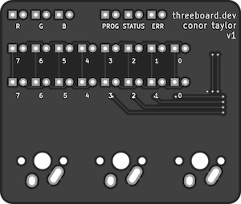

# [threeboard](https://threeboard.dev) 

<!-- TODO: update this image to an animation when it's ready. -->

threeboard is a fully functional multi-layer, programmable, mechanical USB keyboard with only three keys!

Unlike a traditional keyboard, keypresses aren't sent directly to the computer on each keypress. Instead, combinations of the three keys are used to specify key and modifier codes to send to the computer. The multiple layers allow programming key, word, and text blobs for later retrieval.

## What can it do?
threeboard is a fully functional keyboard. That means it can do just as much as the keyboard you currently have on your desk, but with only three keys.

## Why it exists

It's a pointless product, but it's a fun and technically intereting one too. The main goal is to be a pedagogical example of a self-contained hardware and firmware project built from scratch, with no external dependencies. This means that all components, from the USB stack to the PCB hardware designs, are written from scratch and contained in this repository.

It also contains extensive documentation, both in the code and in a set of markdown documents. The C++ firmware code intentionally puts readability over performance, although it remains very concise and performant. It's extensively tested, including end-to-end integration tests which run the complete firmware in a hardware simulator to emulate the physical hardware.

## Read more

### Firmware
[Firmware design overview](taylorconor.com)  
[Using the threeboard simulator](taylorconor.com)  
[Simulated test framework](taylorconor.com)  

### Hardware
[Hardware design overview](taylorconor.com)  
[Manufacturing and assembling the threeboard hardware](taylorconor.com)  
[Component list](taylorconor.com)  

<!-- TODO: add links to relevant documentation. -->

## Building threeboard
Although the threeboard requires custom hardware to run, it also comes with a fully functional terminal-based simulator which runs the firmware on macOS and Linux.

[How to build the threeboard firmware](taylorconor.com)  
[Building and running the threeboard simulator on macOS and Linux](taylorconor.com)  
