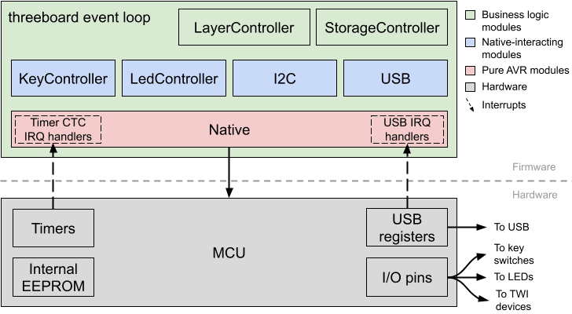
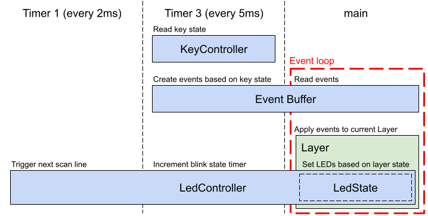
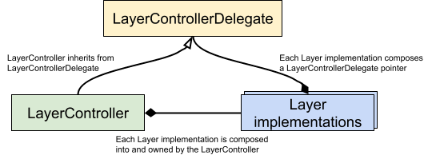
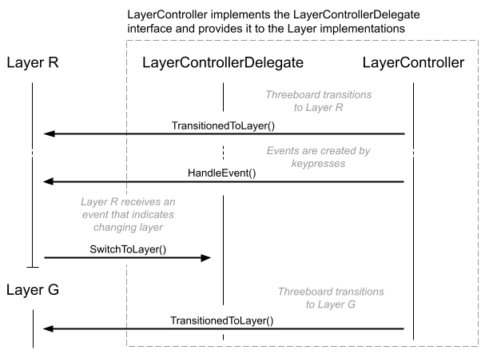
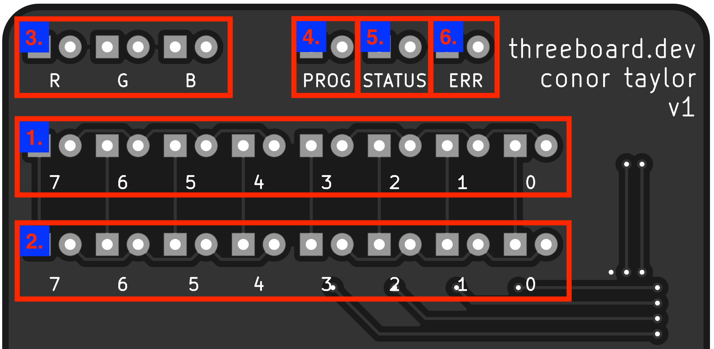
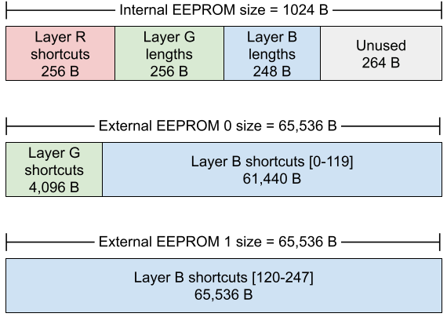

# threeboard firmware design

## Introduction
The threeboard’s firmware has two main functions. The first is to configure and interface with each hardware component on the threeboard (such as LEDs, EEPROMs and USB) according to their respective specifications. The second is to provide user-facing features and functionality to the threeboard as described in the [threeboard user manual](threeboard_user_manual.md).

## Constraints
The threeboard uses an [atmega32u4](https://www.microchip.com/wwwproducts/en/ATmega32u4) microcontroller (MCU), a low-power 8-bit [microcontroller](https://en.wikipedia.org/wiki/Microcontroller) based on the [AVR](https://en.wikipedia.org/wiki/AVR_microcontrollers) enhanced [RISC architecture](https://en.wikipedia.org/wiki/Reduced_instruction_set_computer). Firmware code compiled for this MCU uses the [Atmel AVR instruction set](https://en.wikipedia.org/wiki/Atmel_AVR_instruction_set).

The MCU itself has the following relevant features:

- 8-bit AVR architecture.
- 16MHz maximum frequency at 4.5V.
- 32KB flash-based program memory.
- 2.5KB SRAM.
- 1KB internal EEPROM.
- USB controller hardware support.
- Two 8-bit and two 16-bit timers.
- Byte oriented 2-wire serial interface.

Due to these MCU constraints, this is a bare-metal firmware project. This means that the firmware’s instructions are executed directly on the MCU hardware, without an intervening operating system.

As a result of the lack of operating system, [hardware MMU](https://en.wikipedia.org/wiki/Memory_management_unit), and the severely restricted RAM size, the firmware does not perform any dynamic memory allocation (i.e. no heap allocation). All memory allocation is stack-based.

It’s important to mention that there is no official C++ standard library support for AVR targets. Therefore targets compiled with the AVR C++ compiler, [avr-gcc](https://gcc.gnu.org/wiki/avr-gcc), will not link against libstdc++. All firmware code in the threeboard project cannot use any C++ standard library functions or headers.

## Design principles
The threeboard firmware was designed with several core principles in mind. These are listed below, along with the reasoning for their inclusion:

1. Readability: This is the primary design principle of the firmware. The C++ source itself should be clear, consistent, and well documented. It should be possible for anyone with passable C/C++ knowledge and no embedded programming knowledge to read it and learn from it.
  - Reasoning: Source code with consistent style reduces unnecessary mental load when reading the code, as the code style is predictable. As many people as possible should be able to read and learn from this project, regardless of engineering background. Reducing readability friction helps achieve this goal.
2. Modularity: There should be a clear separation of concerns between different modules of the code, and no interdependence. Modules that need to affect change on other modules should do so via delegation.
  - Reasoning: It’s hard to determine if a class fulfils its responsibilities if it has multiple distinct responsibilities, and it’s hard to guarantee separation of concerns when this mix of responsibilities inevitably leads to reduced encapsulation. Reduced encapsulation causes [dependency hell](https://en.wikipedia.org/wiki/Dependency_hell), which makes code hard to maintain and greatly reduces readability by making the control flow difficult to follow.
3. Testability: Each module must be testable in isolation. All external module dependencies should be abstract to enable mocking and deterministic testing.
  - Reasoning: Untested code should be assumed to have bugs, so full test coverage is essential. Making classes easier to test in isolation makes it easier to write concise test cases.

## Toolchain
The atmega32u4 chip manufacturer (Atmel / Microchip) provides a [toolchain](https://en.wikipedia.org/wiki/Toolchain) for use with AVR development, in particular [avr-gcc](https://www.microchip.com/en-us/development-tools-tools-and-software/gcc-compilers-avr-and-arm), a GCC compiler for AVR. This toolchain works out of the box for all stages of firmware development.

The threeboard firmware is built with [Bazel](http://bazel.build/). Bazel was chosen over more traditional build systems like CMake because it has the following useful properties:

1. Explicit dependencies: All dependencies on a [translation unit](https://en.wikipedia.org/wiki/Translation_unit_(programming)) must be explicitly defined in the Bazel BUILD file, and each translation unit is compiled in a sandbox environment that only has access to the dependencies that have been explicitly declared. This makes it impossible to introduce implicit project dependencies. Additionally, Bazel fails the build if it detects a dependency cycle.
2. Customisable target declarations: Targets can be used to produce multiple object files, compiled with different compiler settings and even with different compilers. This allows compatible modules to be compiled for both x86 and AVR, depending on the context in which it’s being compiled.

Bazel has no pre-existing support for the AVR toolchain, so support had to be added for this project. The [avr-bazel](https://github.com/taylorconor/avr-bazel) repository was built especially for the threeboard project. It contains some special Bazel build rules to produce joint x86 and AVR build targets. This allows defining a single target definition per BUILD file to produce libraries for both targets, to avoid having to double-declare them.

## Architecture
### Overview
The architecture of the threeboard firmware can roughly be grouped into three categories of modules/classes:

1. Business logic modules: These codify the functionality of the firmware, and coordinate other modules to execute this functionality.
2. Native-interacting modules: Generally serve the purpose of configuring and controlling a single hardware element, such as LEDs or USB.
3. Pure AVR modules: Modules that can only be compiled for the AVR architecture, i.e. those that interact directly with hardware.

<p align="center">
  
</p>

Everything except pure AVR modules target both AVR and x86 targets, which enables tests to run on x86 development hosts. These modules don’t depend on any avr-libc headers, so all of their interactions with hardware are proxied through the firmware’s `Native` interface, which exposes an API to interact with hardware. The interface itself does not depend on avr-libc, so non-pure modules can depend on it. When the firmware is compiled to be run on an AVR host or simulator, an avr-libc dependent `Native` implementation (`NativeImpl`) is used.

### Event loop
The core of the threeboard firmware is a simple event loop; a design pattern that waits for and dispatches events to relevant modules when they arrive. The event loop is a never-ending loop that runs as long as the firmware is running (i.e. as long as the device has power).

The responsibilities of the different timers used, and the encapsulation afforded by the event loop is summarised in the diagram below:
<p align="center">
  
</p>

Each event loop iteration is triggered by an [interrupt](https://en.wikipedia.org/wiki/Interrupt). Two timer-based interrupts are used in the threeboard firmware: Timer 1 in CTC mode is configured to produce a software interrupt every 2ms, and is used to refresh the next LED scan line; Timer 3, also in CTC mode, is configured to produce a software interrupt every 5ms, used mainly to poll the key switches and produce events on the event buffer if necessary. Running timer 3 slower and separately from timer 1 allows us to avoid debouncing the [Cherry MX](https://en.wikipedia.org/wiki/Cherry_(company)#Cherry_MX_switches_in_consumer_keyboards) key switches in software.

The purpose of the event loop is to receive and process all keypress events according to the actions defined in the current `Layer` of the threeboard. Each `Layer` instance encapsulates all business logic relating to inputs and actions for a given layer, so this doesn’t need to happen in a long list of if/else statements within the main program loop.

```c++
void Threeboard::RunEventLoop() {
  // USB setup and configuration.
  ...

  // Main event loop.
  while (true) {
    // Atomically check for new keyboard events, and either handle them or
    // sleep the CPU until the next interrupt.
    native_->DisableInterrupts();
    if (!event_buffer_->HasEvent()) {
      // Sleep the CPU until another interrupt fires.
      native_->EnableCpuSleep();
      native_->EnableInterrupts();
      native_->SleepCpu();
      native_->DisableCpuSleep();
    } else {
      if (event_buffer_->HasKeypressEvent()) {
        layer_controller_.HandleEvent(event_buffer_->GetKeypressEvent());
      }
      // Re-enable interrupts after handling the event.
      native_->EnableInterrupts();
    }
  }
}
```

The sleep enabled bit is set before each sleep and cleared after each sleep, as recommended in the atmega32u4 datasheet (section 7.9.1): _it is recommended to write the Sleep Enable (SE) bit to one just before the execution of the SLEEP instruction and to clear it immediately after waking up_.

When finished handling events in the event buffer, the event loop puts the MCU into idle mode. In this mode, the CPU clock is stopped, but the clock powering the MCU’s timers continues. The MCU is brought out of idle mode when the timer produces a software interrupt. The purpose of the event loop can therefore be thought of as to efficiently facilitate delegation between each module in the threeboard, without requiring [busy-waiting](https://en.wikipedia.org/wiki/Busy_waiting).

### Delegation
The threeboard makes extensive use of [delegation](https://en.wikipedia.org/wiki/Delegation_pattern) to allow different modules in the firmware to communicate with each other without introducing circular dependencies.

In certain situations, two-way function calling between modules is necessary. The first of such situations this document will explain is the `LayerController`. It needs to be able to provide events to individual `Layer`s to be handled. But some of these events may trigger an action that affects the `LayerController` itself, such as a keypress event that triggers the threeboard to switch layers. In this case, the current `Layer` uses the `LayerControllerDelegate` to call `SwitchToLayer()` on the `LayerController`, without having to explicitly depend on the `LayerController`:
<p align="center">
  
</p>
<br>
<p align="center">
  
</p>

The `Threeboard` class event loop receives timer interrupts in a similar fashion to the `LayerController`. In this case, the `Native` implementation is not owned by the `Threeboard` class, instead it’s passed in as part of the bootstrapping process. This allows `Native`-specific timers to call functions in the `Threeboard` class (via the `TimerInterruptHandlerDelegate`) without introducing a circular dependency:
<p align="center">
  
</p>

### LED indicators
The LED indicators on the threeboard are vital to understanding the current state of the threeboard. The hardware is equipped with 22 single-colour LEDs. These are arranged as follows:
<p align="center">
  
</p>

1. 8 LEDs to display the binary value of bank_0 (1 byte).
2. 8 LEDs to display the binary value of bank_1 (1 byte).
3. 3 LEDs to display the current layer, which is one of R, G or B (or DFLT if no LEDs are lit).
4. 1 PROG LED to identify when the device is in PROG mode.
5. 1 ERR LED to indicate an error.
6. 1 STATUS LED to provide context-specific status information.

The hardware-specific details of these LEDs, such as their wiring and tolerance, is described in the [hardware design](hardware_design.md) document.

The LED indicator lights are all controlled by the `LedController`. This class is responsible for maintaining the state of the raster scan and outputting the `LedState` (a simple class for storing the state of each LED) to hardware. Its interface is very simple:

```c++
class LedController {
 public:
  explicit LedController(native::Native *native);

  // Handles rendering of the next scan row. Called by the timer interrupt
  // handler every 2ms.
  void ScanNextLine();

  // Handles timing of LED blinking. Called by the timer interrupt handler every
  // 5ms.
  void UpdateBlinkStatus();

  // state_ is guaranteed to live for the entire lifetime of the firmware.
  LedState *GetLedState() { return &state_; }
};
```

As discussed in the hardware section, the LEDs on the threeboard are arranged in a 5 row, 4 column matrix. When the `ScanNextLine()` function is called, the active LEDs in the next row of the matrix are lit, and all other LEDs are turned off. `ScanNextLine()` is called every 2ms by timer 1, which provides a 100Hz refresh rate on the threeboard’s LEDs.

The `LedController` is also responsible for maintaining the timing of blinking LEDs. `UpdateBlinkStatus()` increments an 8-bit blink timer. Two blink states are supported by the threeboard: `LedState::BLINK` repeatedly flashes the selected LED, and `LedState::PULSE` flashes the LED once and then reverts to `LedState::OFF`.

### USB stack
The threeboard contains a full USB device implementation. The threeboard presents itself to hosts as a [USB version 2.0](https://www.usb.org/document-library/usb-20-specification) keyboard [HID device](https://en.wikipedia.org/wiki/USB_human_interface_device_class), complies with HID [version 1.11](https://www.usb.org/document-library/device-class-definition-hid-111), and passes [USB CV test specification 0.72](https://www.usb.org/document-library/usb-31-command-verifier-compliance-test-specification-version-072).

The USB protocol is extremely complex and so is not explained in this document. To learn how USB works, I recommend the [USB in a NutShell](https://www.beyondlogic.org/usbnutshell/usb1.shtml) series of articles, and to use the [USB 2.0 specification](https://www.usb.org/document-library/usb-20-specification) as a reference. This section will summarise the design and architecture of the threeboard’s USB stack without going into any detail about the USB standard.

In the threeboard firmware, the USB stack is abstracted behind a minimal interface:

```c++
class Usb {
 public:
  // Setup the USB hardware to begin connection to the host. This method blocks
  // until the device hardware is correctly set up. If this method returns false
  // it means setup was halted by an error issued via the ErrorHandlerDelegate
  // and is in an undefined state.
  virtual bool Setup() = 0;

  // Returns true if the HID device configuration has completed successfully.
  virtual bool HasConfigured() = 0;

  // Send the provided key and modifier code to the host device. Returns false
  // if an error occurred during sending.
  virtual bool SendKeypress(uint8_t key, uint8_t mod) = 0;
};
```
The `UsbImpl` class is the concrete implementation of the `Usb` interface and interacts with the MCU’s USB registers and functionality using the `Native` interface. Failure to set up correctly via `Usb::Setup()`, and subsequent failure to configure within the first 50 USB frames (50ms) using `Usb::HasConfigured()` will stall the threeboard’s firmware startup logic, and enter an error state that continuously attempts to establish a connection to the host over USB.

USB setup begins with the firmware configuring the MCU to enable an electrical USB connection with the host device, as defined in the atmega32u4 datasheet, section 21.12. For example, the MCU contains [phase-locked loop (PLL)](https://en.wikipedia.org/wiki/Phase-locked_loop) hardware. When enabled, this can convert the external 16MHz clock signal to a 12MHz clock needed for the USB controller hardware in the MCU when configured in full-speed mode (atmega32u4 datasheet, section 21.2):

```c++
bool UsbImpl::Setup() {
  // Enable the USB pad regulator (which uses the external 1uF UCap).
  native_->SetUHWCON(1 << native::UVREGE);
  // Enable USB and freeze the clock.
  native_->SetUSBCON((1 << native::USBE) | (1 << native::FRZCLK));
  // PLL Control and Status Register. Configure the prescaler for the 16MHz
  // clock, and enable the PLL.
  native_->SetPLLCSR((1 << native::PINDIV) | (1 << native::PLLE));
  // Busy loop to wait for the PLL to lock to the 16MHz reference clock.
  WAIT_OR_RETURN(!(native_->GetPLLCSR() & (1 << native::PLOCK)), UINT16_MAX,
                 "Failed to lock PLL during USB setup");
  // Enable USB and the VBUS pad.
  native_->SetUSBCON((1 << native::USBE) | (1 << native::OTGPADE));
  // Configure USB general interrupts (handled by the USB_GEN_vect routine). We
  // want to interrupt on start of frame (SOFE), and also on end of reset
  // (EORSTE).
  native_->SetUDIEN((1 << native::EORSTE) | (1 << native::SOFE));
  // Connect internal pull-up attach resistor. This must be the final step in
  // the setup process because it indicates that the device is now ready.
  native_->SetUDCON(native_->GetUDCON() & ~(1 << native::DETACH));
  return true;
}
```

Once the device hardware is correctly set up, the threeboard informs the host of its capabilities using a series of [descriptors](https://www.beyondlogic.org/usbnutshell/usb5.shtml). The device descriptor specifies fundamental information about the device (including which USB standard it supports and its unique ID). Other important descriptors follow, which inform the host of the class of the device; in this case a [HID-compatible](https://en.wikipedia.org/wiki/USB_human_interface_device_class) keyboard device.

All USB communication is host-centric. This means that no data can be sent from the device to the host unless the host requests it. For this reason, the threeboard’s USB stack is interrupt-driven. The atmega32u4 provides hardware support to issue software interrupts identifying the beginning of a USB message frame, which is the USB host potentially requesting information from the device, such as keypress data or specific descriptor information, for example, to determine what strings to display as the name of the USB device on the host computer. The threeboard’s USB interrupts are facilitated by the `UsbInterruptHandlerDelegate`, which allows the Native layer to pass messages to the USB stack without dependency issues, as discussed in the [delegation](#delegation) section.

Once the USB stack has correctly configured, the threeboard’s firmware enters the [event loop](#event-loop). Individual layers can decide when to flush their state to the USB host (using `Layer::FlushToHost()`) based on their received keypress events. This triggers one or more `UsbImpl::SendKeypress()` calls, which attempts to send an individual key presses to the host over USB:

```c++
bool UsbImpl::SendKeypress() {
  uint8_t intr_state = native_->GetSREG();
  native_->DisableInterrupts();
  uint8_t initial_frame_num = native_->GetUDFNUML();
  while (true) {
    native_->SetUENUM(kKeyboardEndpoint);
    native_->EnableInterrupts();
    // Check if we're allowed to push data into the FIFO. If we are, we can
    // immediately break and begin transmitting.
    if (native_->GetUEINTX() & (1 << native::RWAL)) {
      break;
    }
    native_->SetSREG(intr_state);
    // Ensure the device is still configured.
    RETURN_IF_ERROR(hid_state_.configuration);
    // Only continue polling RWAL for 50 frames (50ms on our full-speed bus).
    if ((native_->GetUDFNUML() - initial_frame_num) >= kFrameTimeout) {
      return false;
    }
    intr_state = native_->GetSREG();
    native_->DisableInterrupts();
  }

  SendHidState();
  native_->SetSREG(intr_state);
  return true;
}
```

### Storage
The threeboard is equipped with three [EEPROM](https://en.wikipedia.org/wiki/EEPROM) storage devices: One 1 KB EEPROM built into the atmega32u4 MCU, and two 512 kbit external EEPROMs connected to the MCU via the MCU’s TWI (two-wire interface) bus. These communicate with the MCU using the [I2C protocol](https://en.wikipedia.org/wiki/I%C2%B2C).

In firmware, the data in these storage devices are all controlled on a high level by the `StorageController`, which is used by each of the programmable `Layer`s for their respective storage needs. The `StorageController` uses the I2C module to abstract away the interfacing logic between the MCU and relevant EEPROMs.

The internal 1 KB EEPROM is used to store all of the character shortcuts for Layer `R`, in addition to the lengths of each of the shortcuts stored in layers G and B. The first external EEPROM (referred to as EEPROM 0) stores each of the word shortcuts for Layer `G`, along with the first 120 blob shortcuts for Layer `B`. The second external EEPROM (EEPROM 1) stores the remaining 128 shortcuts Layer `B` shortcuts.

Because Layer `B` (the blob shortcut layer) allows storage of per-character USB modifier codes, these must be stored in EEPROM along with each keycode. This means that each 256-character blob shortcut requires 512 bytes to store.

The storage layout is visualised below:
<p align="center">
  
</p>

## Style guide
A number of high-level style decisions have been made to make the code as uniform and as readable as possible:

1. All source files must be formatted with [clang-format](https://clang.llvm.org/docs/ClangFormat.html) using the included `.clang-format` config file.
2. Class and member function names use `UpperCamelCase` style. Member variables use `trailing_snake_case_` style, and local variables use `regular_snake_case`.
3. Raw pointers should be used to inject dependencies or for output parameters. They must be non-owning and non-null. Raw pointers are used over references purely because they exhibit [pointer semantics](https://stackoverflow.com/questions/166033/what-do-value-semantics-and-pointer-semantics-mean), making interactions with them more explicit. It follows that non-const references are not allowed.
4. Single-argument constructors must be marked `explicit`, or commented to indicate why implicit construction is favourable.
5. Relative include paths are not allowed.
6. Every class definition should have a comment explaining the function of the class. Each method and member declaration should also have comments unless trivial.

## Testing strategy
The threeboard firmware is tested using three different testing levels:

1. Unit tests: Simple test cases for individual classes. These tests generally [mock](https://en.wikipedia.org/wiki/Mock_object) all of the dependencies of the class under test, and set expectations on how the mocks will be used by the class. The threeboard firmware is written with this testability in mind, and most classes take pointers to abstract classes as their dependencies in their constructors. These abstract classes generally have two implementations: a ‘real’ implementation and a mock. Mock instances will be passed to the class during testing.
2. Simulated integration tests: This test suite uses the full simulated firmware (using the [threeboard simulator](simulator_user_manual.md) to run tests against the entire threeboard firmware end-to-end. These tests apply a sequence of keypresses to the simulated firmware and make expectations on USB interactions, LED states and character output.
3. Simulated property tests: The property test suite uses a similar setup to the integration tests in that tests are run end-to-end on the simulated threeboard firmware. This test executes keypresses on the simulator, and also on a threeboard model, used to represent the desired behavior of the system under test. The test generates a random sequence of 25,000 input keypresses, executes them one at a time, and asserts the property that the simulator and the threeboard model must share the same state before and after the keypress is processed.

All tests run within the [Google Test framework](https://github.com/google/googletest) for testing and mocking.