# threeboard hardware build instructions
## Manufacturing
<p align="center">
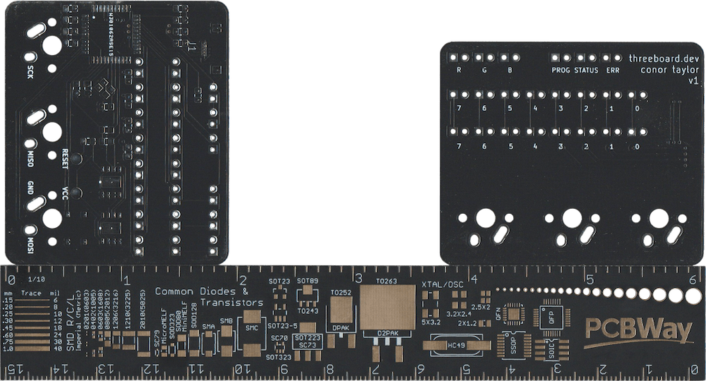
</p>

The threeboard project repository contains all of the files needed to manufacture a threeboard [PCB](https://en.wikipedia.org/wiki/Printed_circuit_board), in the [hardware subdirectory](https://github.com/taylorconor/threeboard/tree/master/hardware). These files can be opened using [KiCad](https://en.wikipedia.org/wiki/KiCad), a common open-source PCB design tool. The PCBs must be manufactured by a professional PCB manufacturing company. I recommend [PCBWay](https://www.pcbway.com/) as I’ve had great experiences using them to manufacture each iteration of the threeboard development boards. To make manufacturing easier, the threeboard repository contains a prebuilt [`gerber.zip`](https://github.com/taylorconor/threeboard/blob/master/hardware/gerber.zip) package which is all that’s needed to be provided to a PCB manufacturer such as PCBWay to manufacture threeboard PCBs.

<p align="center">

</p>

## Soldering
The components required to assemble the threeboard are all listed in the [component list](component_list.md) document. These all need to be soldered to the threeboard’s PCB, and the microcontroller flashed with the threeboard firmware before it’s usable as a keyboard. All components can be soldered by hand and without a microscope, and although the two external EEPROMs and quartz crystal are much easier to solder using a hot air gun, it’s possible to solder everything using just a soldering iron.

<p align="center">
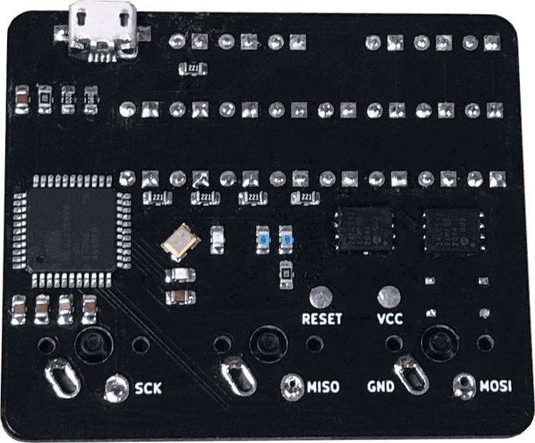
</p>
<br />

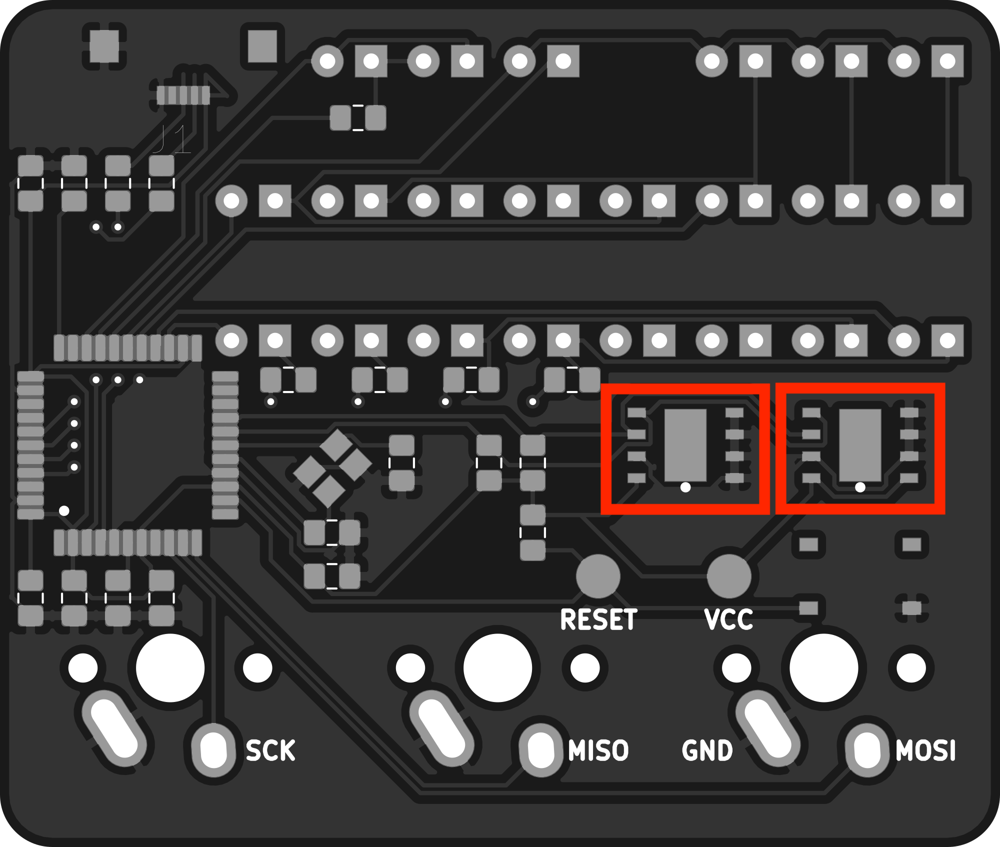

The two [24LC512-I/MF](https://www.digikey.com/en/products/detail/microchip-technology/24LC512-I-MF/523013) EEPROM devices should be soldered first as they’re the trickiest to hand-solder with a soldering iron. If they’re being soldered with a hot air gun, soldering them first prevents other nearby components from being damaged or displaced by the hot air. Solder the EEPROMs into the highlighted footprints, oriented so that their visual positioning indicators are positioned in the lower right corner.
<br clear="right"/>
<br clear="left"/>
<br />

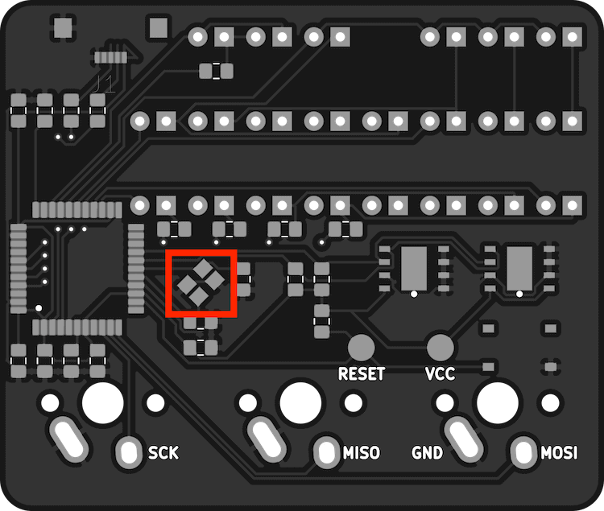

The quartz crystal should be soldered next as it’s also tricky to hand-solder, and can also be hot air soldered.
<br clear="right"/>
<br clear="left"/>
<br />

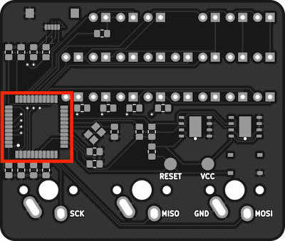

The [ATMEGA32U4-AUR](https://www.digikey.com/en/products/detail/microchip-technology/ATMEGA32U4-AUR/2238241) MCU should be soldered in the highlighted area, with its visual positioning indicator in the bottom left corner.
<br clear="right"/>
<br clear="left"/>
<br />

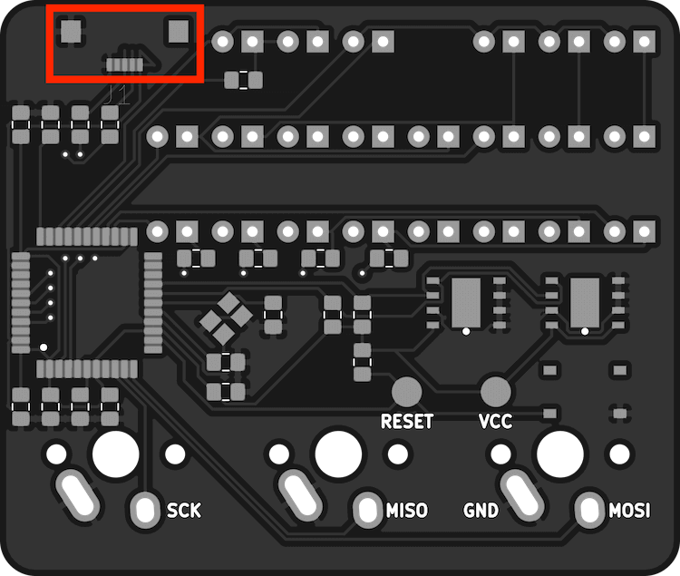

Solder the [USB3070-30-A](https://www.digikey.com/en/products/detail/gct/USB3070-30-A/9859704) USB socket in the highlighted area. The two larger pads on either side are not connected to anything, and just add stability to the connector, which otherwise is quite fragile. These pads can be soldered or glued. I recommend using a small amount of glue between these two pads to secure the connector. The 5 small USB pins can then be soldered once the connector is aligned and secure.
<br clear="right"/>
<br clear="left"/>
<br />

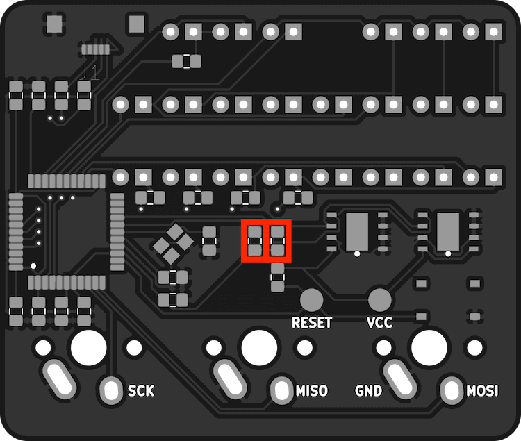

Solder the two [RMCF0805FT4K70](https://www.digikey.ch/en/products/detail/stackpole-electronics-inc/RMCF0805FT4K70/1760659) 4.7kΩ resistors – the pull-up resistors for the EEPROMs – in the highlighted areas.
<br clear="right"/>
<br clear="left"/>
<br />

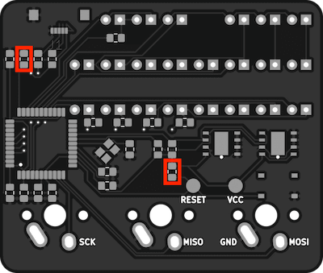

The two [RMCF0805JT10K0](https://www.digikey.com/en/products/detail/stackpole-electronics-inc/RMCF0805JT10K0/1942577) 10kΩ resistors are used as a pull-up resistor for the MCUs RESET pin and a pull-down resistor to inform the MCU to check for USB activity during boot. They should be soldered in the highlighted areas.
<br clear="right"/>
<br clear="left"/>
<br />

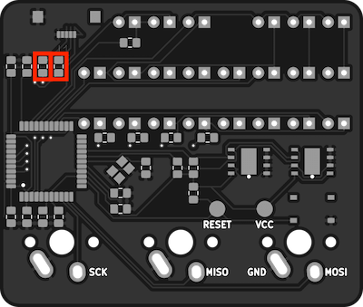

Solder the two [RMCF0805JT22R0](https://www.digikey.com/en/products/detail/stackpole-electronics-inc/RMCF0805JT22R0/1942533) 22Ω resistors in the highlighted areas. These are serially connected between the USB data lines and the MCU.
<br clear="right"/>
<br clear="left"/>
<br />

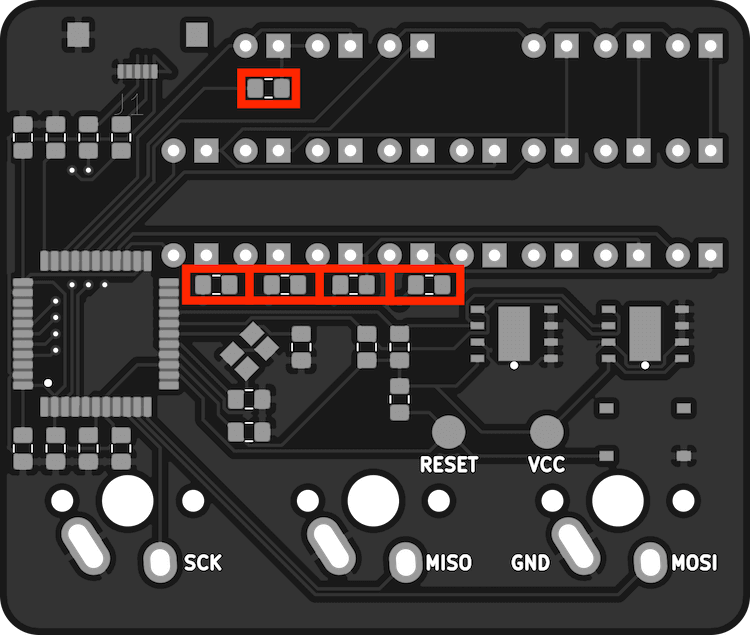

There are five 220Ω resistors needed to protect the LED banks. They should be soldered in the highlighted areas.
<br clear="right"/>
<br clear="left"/>
<br />

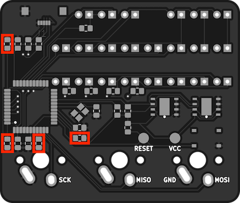

Solder the four [CC0805ZRY5V9BB104](https://www.digikey.com/en/products/detail/yageo/CC0805ZRY5V9BB104/2103145) 0.1uF decoupling capacitors in the areas highlighted.
<br clear="right"/>
<br clear="left"/>
<br />

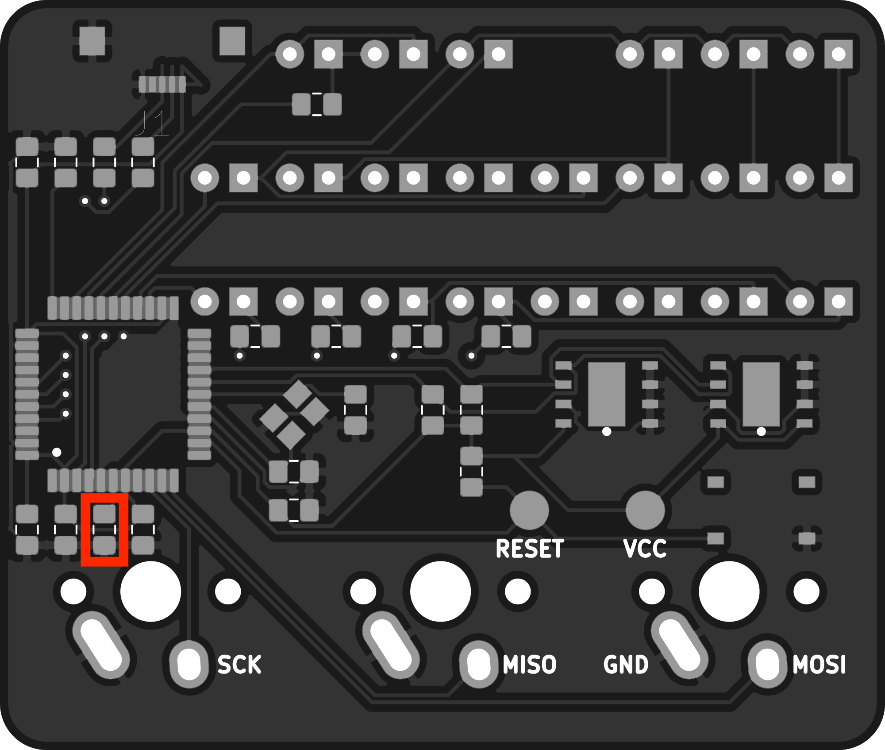

A 1uF capacitor is needed to regulate the USB output supply voltage. Solder the [CC0805KKX7R7BB105](https://www.digikey.com/en/products/detail/yageo/CC0805KKX7R7BB105/2103149) capacitor in the highlighted area.
<br clear="right"/>
<br clear="left"/>
<br />

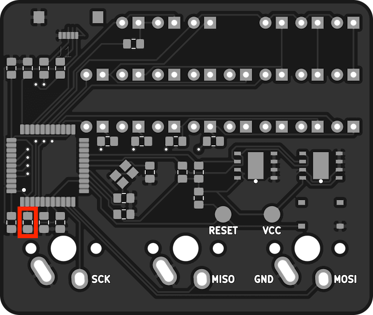

Solder the [CC0805ZRY5V6BB475](https://www.digikey.com/en/products/detail/yageo/CC0805ZRY5V6BB475/2103155) 4.7µF decoupling capacitor in the highlighted area.
<br clear="right"/>
<br clear="left"/>
<br />

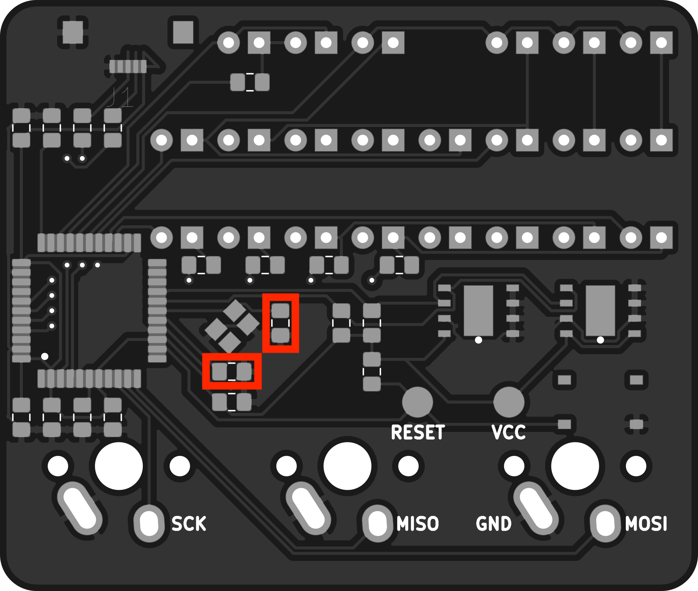

The two [C0805C220J5GACTU](https://www.digikey.com/en/products/detail/kemet/C0805C220J5GACTU/411112) 22pF external clock crystal capacitors should be soldered as shown.
<br clear="right"/>
<br clear="left"/>
<br />

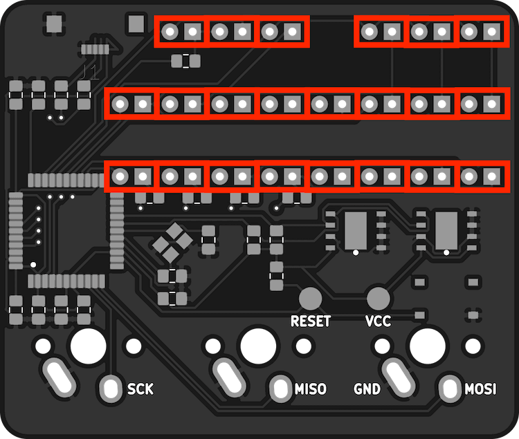

Solder the 22 [LTL-1CHE](https://www.digikey.com/en/products/detail/lite-on-inc/LTL-1CHE/670000) LEDs in the locations shown. Make sure to wire the cathode of the LED to the square through-hole.
<br clear="right"/>
<br clear="left"/>
<br />

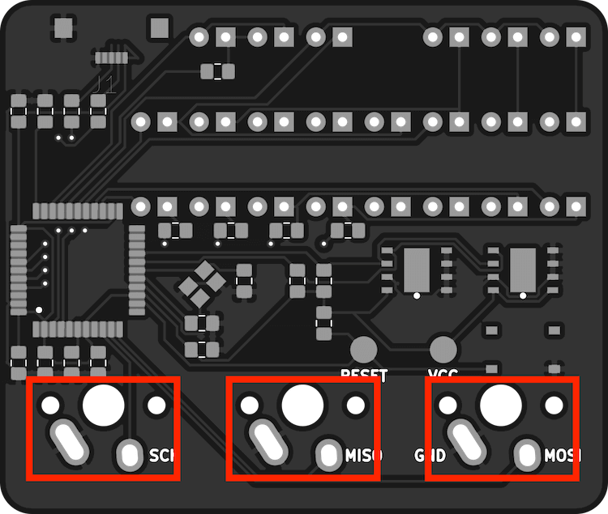

Solder the three Cherry MX keyswitches as shown.
<br clear="right"/>
<br clear="left"/>
<br />

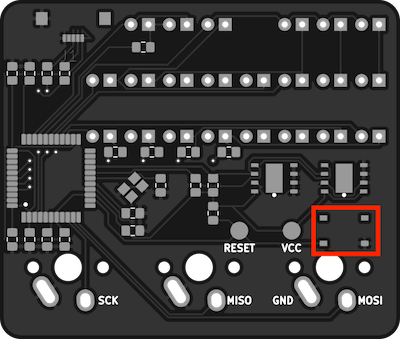

If needed, a [PTS526 SK08 SMTR2 LFS](https://www.digikey.com/en/products/detail/c-k/PTS526-SK08-SMTR2-LFS/10056632) push-button RESET switch can be soldered in the highlighted area. This is only needed when flashing threeboard firmware to the threeboard using a USB bootloader. It may only be needed once, or not needed at all if flashing using SPI.
<br clear="right"/>
<br clear="left"/>
<br />

## Flashing firmware
A freshly constructed threeboard will need to have a [bootloader](https://en.wikipedia.org/wiki/Bootloader) installed before it’s possible to flash the threeboard firmware. For simplicity I suggest installing the Arduino USB bootloader using an [Arduino as an ISP programmer](https://www.arduino.cc/en/Tutorial/BuiltInExamples/ArduinoISP) and following [this guide](https://learn.sparkfun.com/tutorials/installing-an-arduino-bootloader/all). The necessary SPI pins are all labelled on the threeboard: `RESET`, `VCC`, `SCK`, `MISO`, `GND` and `MOSI`. These should be connected to the corresponding pins on the ISP programmer to flash the bootloader.

A threeboard hex file is required to flash the firmware to the device. This is produced by running `bazel build //src:threeboard_hex` from the `threeboard/firmware` directory. Once the threeboard hex file has been successfully built, it can be flashed to the device using the following command:
```
avrdude -v -patmega32u4 -cavr109 -P /dev/cu.usbmodemXXX -b57600 -D -Uflash:w:bazel-bin/src/threeboard_hex.hex:i
```