# threeboard hardware design
## Introduction
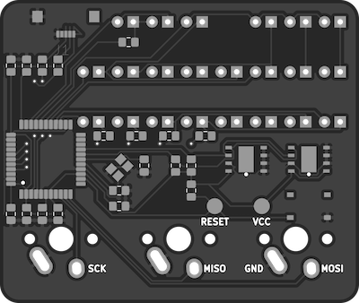

The threeboard’s hardware is a custom-designed PCB. It includes all electrical components needed to operate the threeboard, as well as test points that can be used to flash new firmware to the MCU. The majority of the components used are surface mounted, with through-holes used for some of the larger components.

This section of the document describes the design goals of the threeboard hardware, the choice of components, and electrical design decisions.

## Hardware design goals
Similar to the design principles of the firmware, the threeboard’s hardware was designed with several goals in mind:

1. Simplicity: This implies that nothing should exist on the PCB that isn’t completely necessary for the operation of the threeboard, and any hardware that can be offloaded to the MCU’s hardware (such as making use of the internal pull-up resistors on certain pins) should be. More importantly, simplicity also applies to the hardware design patterns used; it should be possible to learn from the hardware design of the threeboard with little or no electrical engineering experience.
2. Hand-solderable: It should be possible to solder all components onto the threeboard by hand, with only basic soldering experience. This improves the accessibility of the hardware so it can be easily assembled. For example, all resistor and capacitor pads use an SMD [0805 package size](https://eepower.com/resistor-guide/resistor-standards-and-codes/resistor-sizes-and-packages). Also, the atmega32u4 MCU used by the threeboard is the 10x10mm [TQFP](https://en.wikipedia.org/wiki/Quad_flat_package) package, despite the MCU being offered in a smaller 7x7mm [QFN](https://en.wikipedia.org/wiki/Flat_no-leads_package) package, as it would be more difficult to solder.
3. Inexpensive to manufacture: No unnecessarily expensive components should be used, and no PCB features should be included that are difficult (and expensive) to manufacture unless absolutely necessary. For this reason, the threeboard PCB only uses two layers, minimal [through-hole components](https://en.wikipedia.org/wiki/Through-hole_technology), and as few [via holes](https://en.wikipedia.org/wiki/Via_(electronics)) as possible.

## Design
This section is split into subsections that explain the design of each major hardware component. In many cases, images of the threeboard’s PCB and electrical schematic are used to aid the explanation. In these cases, the image of the relevant piece of the PCB will always be on the left, and the relevant part of the schematic on the right.

### USB
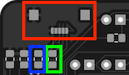
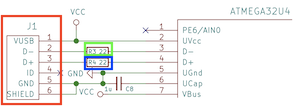
 
 

The threeboard’s USB hardware is very simple because the atmega32u4 has dedicated USB pins that map directly to the USB connector (pictured in red). The only additional hardware required is specified by the atmega32u4 datasheet, sections 2.2.8 and 2.2.9, which states that the D+ and D- USB data upstream ports should be connected to the USB data connector pins via serial 22Ω resistors (pictured in blue and green).

The complexity of the USB integration lies in the firmware. It’s responsible for keeping track of bus timing, issuing interrupts, and parsing and sending messages. This is discussed in detail in the [firmware design document](firmware_design.md).

### LEDs
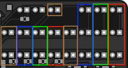
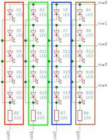
 
 

In order to be able to drive 22 LEDs using only 11 MCU pins, the majority of the threeboard’s LEDs are wired in a [multiplexed matrix](https://en.wikipedia.org/wiki/Multiplexed_display), where each individual LED in the matrix is addressable by a row and column value. In this configuration, all of the LEDs can’t be lit at the same time. Instead, each row of LEDs is scanned over in a [raster scanning](https://en.wikipedia.org/wiki/Raster_scan) fashion, and individual LEDs that should be lit are turned on until the next raster scan turns them off.

This row scanning happens within the firmware and is triggered every 2ms by timer interrupt 1. Given that there are 5 rows, a full refresh takes 10ms, which gives the threeboard’s LED indicators a refresh rate of 100Hz, which is well above the threshold for [perceivable flicker by the human eye](https://en.wikipedia.org/wiki/Flicker_fusion_threshold).

Only one LED from a column is lit at any one time, since only one LED from each column exists in a given row. Each column of LEDs is protected by one 220Ω current-limiting resistor in series to restrict the current to each LED to 22mA (calculated using [Ohm’s law](https://en.wikipedia.org/wiki/Ohm%27s_law) given the 5V input voltage from USB).

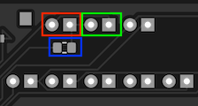
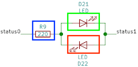
 
 

There are two LEDs on the threeboard that are not included in the multiplexed LED matrix. These are the STATUS (shown in green) and ERR (shown in red) LEDs. They’re configured in parallel with their polarities inverted so that only one can be lit at any given time, and so that only one resistor and two MCU pins are required to drive them. These LEDs are configured in this way for two reasons:

1. 22 LEDs are hard to arrange in a row-column matrix since the number 22 has very few factors. The only configurations would be a 1x22 matrix (which isn’t a matrix) or a 2x11 matrix (which doesn’t reduce the use of LEDs or pins very much). So it’s more economical to put 20 LEDs in a 5x4 matrix and the remaining two in a standalone pair.
2. It’s beneficial when reporting errors or debugging issues with the firmware on the physical board (rather than the simulator) to have some LEDs which can be decoupled from the raster scanning loop. This means that if there are firmware issues with the loop logic, or issues with the MCU’s timer configuration, the STATUS or ERR LEDs can be lit independently of the matrix to help with debugging or surfacing errors.

### Mechanical key switches
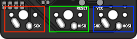
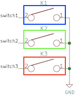
 
 

The threeboard uses [Cherry MX](https://deskthority.net/wiki/Cherry_MX) SPST-NO ([single pole, single throw, normally open](https://en.wikipedia.org/wiki/Switch#Contact_terminology)) mechanical switches for its physical key switches. The [bounce time](https://en.wikipedia.org/wiki/Switch#Contact_bounce) of these switches differs depending on the type of switch and the date of manufacture, but it’s safe to assume that it will be below 5ms. Most modern Cherry MX key switches have a 1ms bounce time.

These switches are wired directly to ground, which means they are configured to be [active low](https://en.wikipedia.org/wiki/Logic_level#Active_state); when pressed, they connect their MCU pin to ground. To avoid the situation where an unpressed switch leaves its corresponding MCU pin floating, each switch defaults to high using a [pull-up resistor](https://en.wikipedia.org/wiki/Pull-up_resistor). The atmega32u4 includes internal pull-up resistors on a number of its pin ports, so all three switches are wired to pins on PORTB which includes internal pull-up resistors as specified by the atmega32u4 datasheet, section 2.2.3, with typical resistances of 20-50kΩ.

The MCU pins used for the key switches were chosen carefully to correspond to the pins used for SCK (shown in red), MISO (shown in green), and MOSI (shown in blue) of the atmega32u4’s [SPI interface](https://en.wikipedia.org/wiki/Serial_Peripheral_Interface). These pins are necessary when flashing new firmware onto the MCU using SPI, and so wiring them to the legs of the key switches removes the need for adding dedicated testing pads to connect these pins to an SPI programmer during flashing.

### External EEPROMs
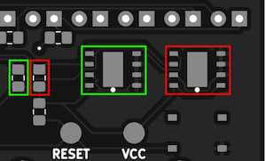
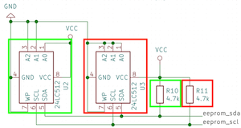
 
 

The threeboard contains two external 512 kbit EEPROM devices. These devices communicate with the MCU using the using its 2-wire serial interface (the [I2C protocol](https://en.wikipedia.org/wiki/I%C2%B2C)). The atmega32u4 MCU has built-in hardware support for this interface, with a dedicated data pin (SDA) and clock pin (SCL), which collectively form the TWI (two-wire interface) bus. This interface is described in detail in the atmega32u4 datasheet, section 20.

The EEPROM devices can both be connected in parallel to these pins, as the I2C protocol uses 7-bit addresses, allowing for up to 128 devices on the same bus. Two 4.7kΩ pull-up resistors are used to pull each bus line high when not driven low by the [open-drain](https://en.wikipedia.org/wiki/Open_collector) interface, as mentioned in the atmega32u4 datasheet, section 20.2: _The only external hardware needed to implement the bus is a single pull-up resistor for each of the TWI bus lines_.

### External quartz crystal clock
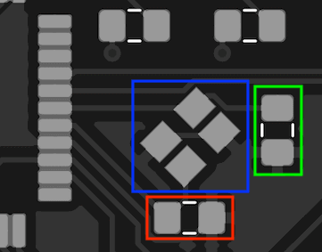
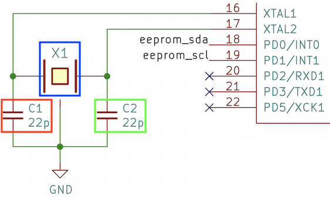
 
 

The threeboard includes a 16MHz quartz crystal oscillator (shown above in blue) as a clock source to the MCU. The MCU contains dedicated hardware pins for use with the external clock (XTAL1 and XTAL2), and the atmega32u4 datasheet, section 6.3, recommends the crystal to be wired as shown in the diagram above, with external capacitors within a 12pF - 22pF range (shown in red and green).

### Decoupling capacitors
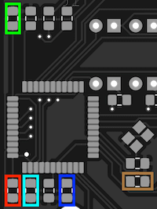

 
 

[Decoupling capacitors](https://en.wikipedia.org/wiki/Decoupling_capacitor) are positioned close to each VCC-connected pin on the MCU, to reduce the effect of voltage spikes and drops from the USB power supply. They are also necessary to facilitate instantaneous current increases that may be required by the MCU, as various actions performed by the MCU may have different current requirements.

### MCU
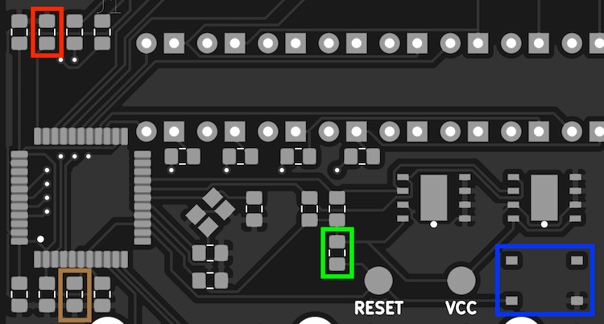
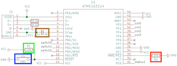
 
 

The threeboard includes a reset push button to help flash firmware to the MCU during development. The reset switch (shown above in blue) is connected to the RESET pin in the MCU, pulled up to VCC with a 10kΩ pull-up resistor (shown in green). Additionally, the HWB pin is forced low to instruct the MCU to execute the USB bootloader on reset, which allows flashing new firmware on reset. To force it low, it’s tied to ground using a 10kΩ pull-down resistor (shown in red) to prevent the pin from floating.

As specified in the atmega32u4 datasheet, section 2.2.12, the UCap pin must be connected to a 1μF capacitor to regulate the USB output supply voltage.