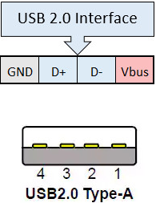
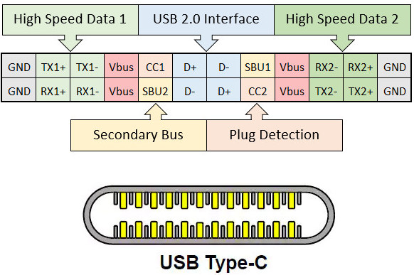
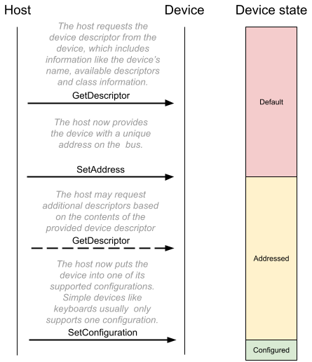
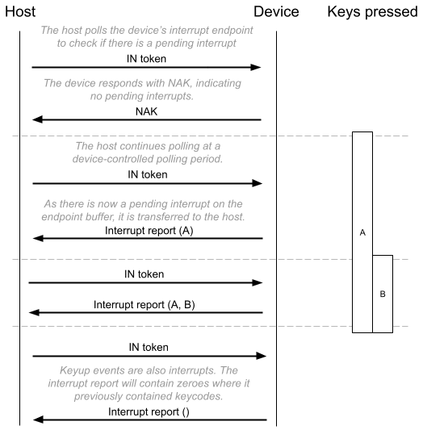

# How do USB keyboards work?

This section describes on a very high level how most USB 2.0 keyboards interact with their connected computer (the host) via USB, from connection to device setup to keypress handling. It is not intended to be a definitive explanation, just an overview. For more detailed explanations, I recommend the [USB in a NutShell](https://www.beyondlogic.org/usbnutshell/usb1.shtml) series of articles, parts of which have been included in this section. The full 650 page [USB 2.0 specification](https://www.usb.org/document-library/usb-20-specification) can also be useful as a reference.

## Overview
USB stands for Universal Serial Bus, a name which identifies the three main properties of USB:

- Universal: Designed to be able to support any kind of peripheral device.
- Serial: There is only one stream of data being sent over the wire at a time (as opposed to a _parallel bus_ that supports multiple concurrent streams).
- Bus: A network topology in which all of the various devices in the network are connected to a single shared data line.

USB 2.0 is a single host, multiple device protocol. There must be exactly one host device coordinating all communication on the wire. In most cases, the host is a PC or laptop, and the devices are any connected peripherals like keyboards, mice, webcams etc. Each device is assigned a unique 7-bit address when it first connects to the host (a process known as _device enumeration_), so up to 127 devices can be connected to a single USB bus at a time. Most computers will have multiple USB busses, e.g. one per external USB port.

The USB protocol defines several data transfer modes. Which mode a device chooses depends on the intended use of the device:

- Control: Used for device enumeration and setup, for example for informing the host about the name and manufacturer of the device, and for selecting which other mode the device will use as its main mode of operation.
- Interrupt: Non-periodic, low-latency, low data throughput communication. An Interrupt request is queued by the device until the host polls it to ask for data. This is typically used for rare but time-sensitive events, such as mouse clicks or keyboard keypresses.
- Bulk: Used for large, potentially bursty data transfers. Bulk transfers provide error correction on the payload, and error detection/re-transmission mechanisms, ensuring data is transmitted and received without error. This transfer mode is commonly used in USB memory sticks.
- Isochronous: This allows a device to reserve a defined amount of bandwidth with guaranteed latency, and perform periodic transfers. This is useful in audio or video applications where congestion may cause loss of data or framerate, such as webcams.

USB keyboards spend most of their time transferring data in the interrupt mode because the host needs to react quickly to keypress events to avoid perceivable lag.

The USB protocol identifies the functionality of a device using _device classes_, defined by a class code sent to the host. This allows the host to e.g. load drivers for the device and to support new devices from different manufacturers, making USB universal. The USB standard specifies some standard device classes, but manufacturers can implement their own using the wildcard “vendor-specific” class type. One standard-defined class is the [Human Interface Device (HID)](https://en.wikipedia.org/wiki/USB_human_interface_device_class) class; this class includes devices intended to be used by humans to interact with a computer, such as keyboards and mice. The threeboard implements this USB HID class to identify itself as a keyboard.

## Connector wiring

The wiring of a USB 2.0-only connector (i.e. a connector capable of up to a 480 Mbit/s “high speed” data rate) is quite simple, with only 4 pins needed:

- VBUS: 5V power line.
- D-: Part of differential pair data line.
- D+: Part of differential pair data line.
- Ground.

USB 3.0 requires an additional 5 pins for a total of 9, but keeps the same connector types. Sometimes these have blue inserts to indicate USB 3.0 compatibility, but retain backwards compatibility with USB 2.0. Type A connectors are only used on hosts (e.g. computers), and Type B connectors are only used on devices (e.g. phones, keyboards), but they have the same wiring and pin configuration. Newer Type C connectors (often called “USB-C”) are omnidirectional and are the only connector type that supports USB 4.0. These connectors are radically different, with 24 pins, but still maintain backwards compatibility with all previous USB standards. This is possible because USB-C contains the 4-pins USB 2.0 configuration as a subset of its 24 pins.

The _differential pair_ data line is an implementation of [differential signalling](https://en.wikipedia.org/wiki/Differential_signalling). Two wires are used but the data line remains serial.

The remainder of this document assumes the USB 2.0 standard. Although as discussed, keyboards implementing USB 2.0 can still have USB-C connectors by using its USB 2.0 subset.

## Hardware and firmware
It’s important to think of a USB keyboard as a computer in its own right. To be able to fully implement the USB protocol, keyboards generally contain a 5V microcontroller with clock speeds up to 80MHz, as much as 100 KB of RAM, and hardware support for the USB protocol. These microcontrollers use RISC instruction sets, such as [ARM](https://en.wikipedia.org/wiki/ARM_architecture) or [AVR](https://en.wikipedia.org/wiki/AVR_microcontrollers). [Firmware](https://en.wikipedia.org/wiki/Firmware) runs on the keyboards microcontroller, implementing everything from checking for keypresses and lighting status LEDs to implementing the USB protocol and communicating with the host. [QMK](https://qmk.fm/) is a popular ARM and AVR-compatible open-source keyboard firmware. The threeboard uses its own custom-built firmware, available in this repository.

## Device enumeration
USB device enumeration is the process where hosts detect, identify and in some cases load drivers for a USB device. This section won’t go into any of the electrical details of how hosts detect when a device has been plugged in, instead it will focus on how devices use the USB protocol to identify themselves to the host. However one important electrical feature of this process is how the host determines the speed of the device; the USB D+ is connected to VBUS with a pull-up resistor, indicating full-speed 12 Mbps mode. Connecting USB D- instead would specify the low-speed 1.5 Mbps operating mode.

When a USB device is being enumerated, it cycles through several configuration states: _default_, _addressed_ and _configured_. Once a device has been plugged in and is receiving power from the host, it enters the _default_ state. In this state, it has not even been assigned an address yet. The process from _default_ to _configured_ (i.e. usable) state is visualised below:

The threeboard’s enumeration values (such as its device descriptor and additional HID descriptors) are all specified in [`usb/internal/descriptors.h`](https://github.com/taylorconor/threeboard/blob/master/firmware/src/usb/internal/descriptors.h).

## Sending keypress events
During enumeration, a USB keyboard will have provided an _endpoint descriptor_ to the host. This is used to describe all of the USB _endpoints_ a device supports. Endpoints are essentially isolated data buffers on the USB device, with important properties including a transfer direction (IN, meaning device to host, and OUT, meaning host to device) and a transfer type (control, interrupt, bulk, isochronous). USB devices all must provide at least one _control endpoint_ (endpoint 0), which is the endpoint used during enumeration. Devices may provide multiple additional endpoints e.g. for interrupting the host with keypress data.

USB keyboards may be configured differently depending on their functionality, but in the most basic case (and in the case of the threeboard), a USB keyboard provides only one additional endpoint, an IN endpoint 1, with an interrupt transfer type. The host polls the device as frequently as every 1ms (this polling period is configurable in the endpoint descriptor) to check if the device has an interrupt in its endpoint buffer waiting to be sent to the host. A USB HID-compliant keyboard device will put a _keyboard input report_ message in its IN buffer, which contains up to 6 keypress codes and a modifier code, identifying all of the modifier keys being pressed. The _keyboard input report_ is 8 bytes long and contains one modifier keycode byte, one reserved byte, and 6 keycode bytes. A table mapping these bytes to key codes is defined in section 10 of the [HID usage tables](https://github.com/taylorconor/threeboard/blob/master/documentation/manuals/HID%20usage%20tables.pdf) document.

An example host polling sequence is visualised below:

