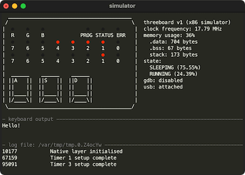
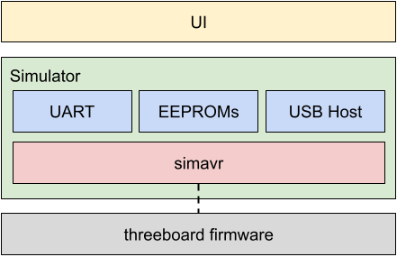

# threeboard simulator user manual and design

## Introduction

Debugging embedded firmware is generally difficult and slow, as target hardware limitations usually prevent meaningful logging or the ability to connect a debugger and use real-time software breakpoints. Developing embedded firmware without access to a simulator means all firmware needs to be flashed and run on the target hardware, which becomes cumbersome.

For these reasons, the threeboard project includes a fully functional terminal-based threeboard simulator for Linux and macOS, built on top of the [simavr project](https://github.com/buserror/simavr). The simulator enables running and debugging of the threeboard AVR firmware on the same x86 platform used for development, which greatly improves development speed and makes debugging far easier and more accessible. Most importantly, the firmware being simulated is the same firmware binary that runs on physical hardware: no simulator-specific code paths exist in the firmware, although [UART](https://en.wikipedia.org/wiki/Universal_asynchronous_receiver-transmitter)-based logging is disabled when building for physical hardware.

## Features
The simulator runs a terminal-based graphical emulator of the threeboard hardware, designed to look as similar as possible to the actual threeboard hardware, with the LEDs and key switches laid out almost identically.

Other simulator features include:

- GDB debugging support: The simulator exposes a [gdbserver](https://en.wikipedia.org/wiki/Gdbserver) to enable debugging of the firmware being simulated. Disabled by default, when enabled (by using the shortcut key `g`) the server runs locally on port 1234.
- Mock USB host: To simulate communication between the threeboard and a USB host (a computer), the simulator includes a mocked USB host which appears to the simulated firmware as a real USB host computer. The firmware will send keypresses over USB to the mocked host just as it would to a real host, and the simulator outputs these keypresses to the simulator UI in the “keyboard output” section of the UI.
- Logging: The threeboard simulator includes a mock data receiver capable of receiving logging information from the simulated threeboard firmware via the simulated hardware’s UART pins. `LOG()` and `LOG_ONCE()` macros in the firmware produce logs that are transmitted to this mock data receiver in the simulator. These macros are only enabled when building the firmware for the simulator, because the threeboard firmware doesn’t correctly initialise the UART pins or clock, it takes advantage of simavr’s UART implementation to transmit data instantaneously from the firmware to the simulator.
- MCU state visualisation: Several high-level states are used by simavr to categorize the MCU’s current operating mode. Examples include `RUNNING`, `SLEEPING` and `CRASHED`. The threeboard simulator includes a visualisation of the amount of time spent in each state while running the simulator, which is useful when trying to optimise power usage or detect infinite or expensive loops in firmware.
- Memory usage indicator: The simulator includes a simple memory usage indicator, which displays both static memory usage (from [`.data`](https://en.wikipedia.org/wiki/Data_segment) and [`.bss`](https://en.wikipedia.org/wiki/.bss) segments) and dynamic memory usage. Since the threeboard hardware constraints forbid dynamic memory allocation, the dynamic memory usage is an indication of stack use.
- Mock LED permanence: The simulator’s terminal-based UI displays the threeboard’s LEDs in red (on) or grey (off). The simulator attempts to emulate the LED matrix permanence property discussed in the [hardware design](hardware_design.md) section, by setting a minimum time an LED may be lit for. This makes the simulated LEDs in the terminal behave as similarly as possible to the real LEDs on the threeboard, and makes it possible to spot timing bugs or other issues with the LEDs raster scanning logic.

## Design

The simulator is effectively a wrapper around [simavr](https://github.com/buserror/simavr), an exceptionally good AVR simulator that supports lots of features of many AVR microcontrollers, and is easy to configure with new MCUs and features. Simavr does most of the difficult work of simulating the firmware: given the threeboard firmware binary file, simavr parses it, determines the properties of the MCU being simulated based on headers in the binary, and can execute the instructions one cycle at a time. It supports interrupts and timing, and has full support for the atmega32u4’s USB controller. 

Events are issued and handled in simavr using [IOCTL calls](https://en.wikipedia.org/wiki/Ioctl). These allow a way of triggering arbitrary functionality and message passing within simavr, which enables its configurability.

The simulator is comprised of several interoperating modules which emulate the properties of different hardware components on the threeboard. Modules are needed for external components (EEPROMs and UART) and for emulating a USB host machine to send keypress information.

  

The UI module is responsible for translating the state of the simulator into a visualisation of the result of that state on the threeboard’s hardware, in particular its LEDs. It’s a purely [text-based user interface](https://en.wikipedia.org/wiki/Text-based_user_interface) implemented using [ncurses](https://en.wikipedia.org/wiki/Ncurses). The static outlines and frames of the UI are drawn once, and the dynamic components are redrawn at a rate of 200Hz.

The USB host component is far from a standards-compliant host implementation. It contains the least amount of logic required to make the threeboard firmware believe it is communicating with a real USB host. It simply polls the USB controller in firmware by triggering USB general interrupts which cause the firmware to periodically send its HID state over USB.
