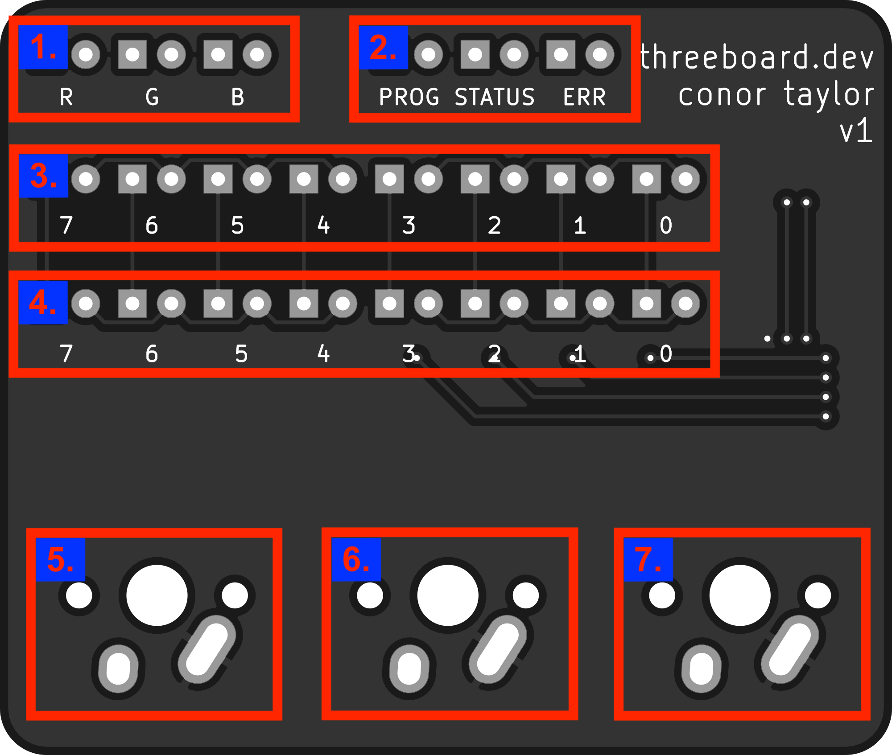
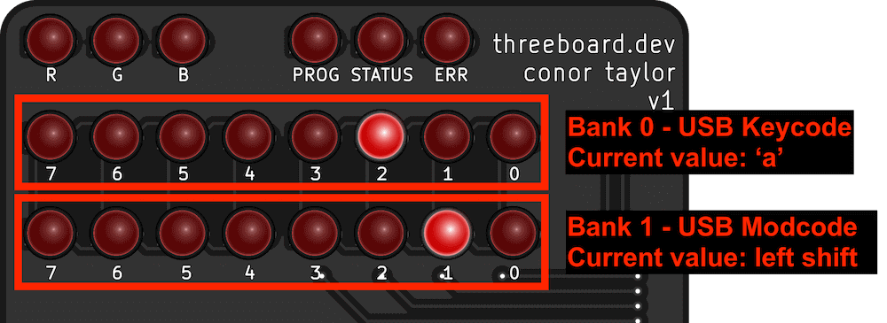
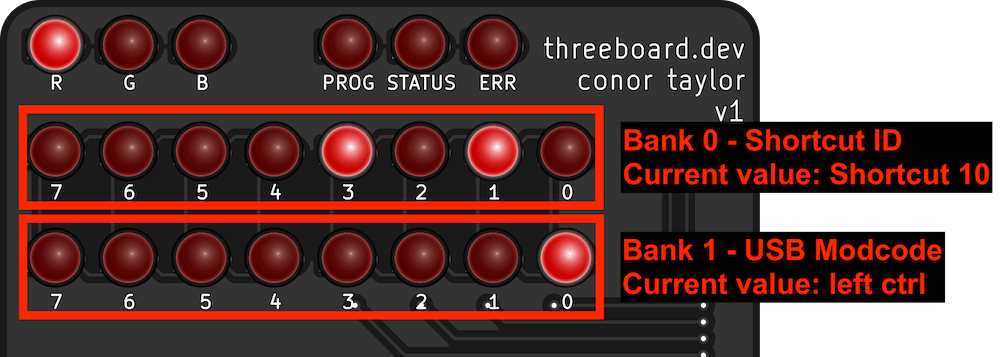
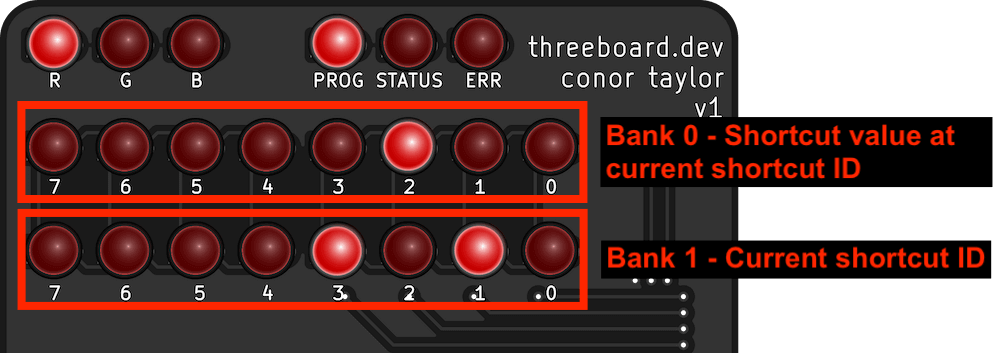
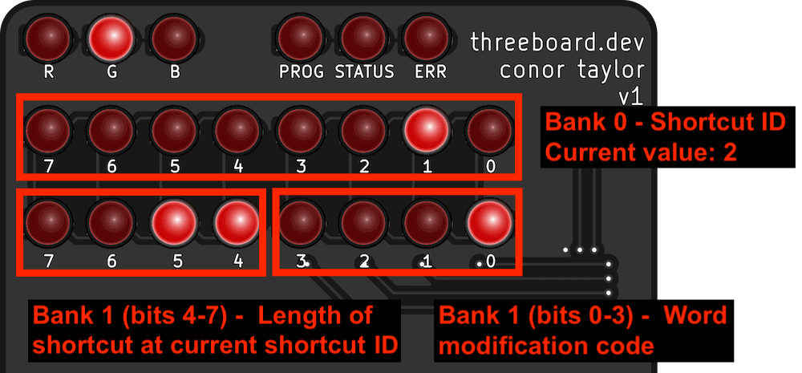
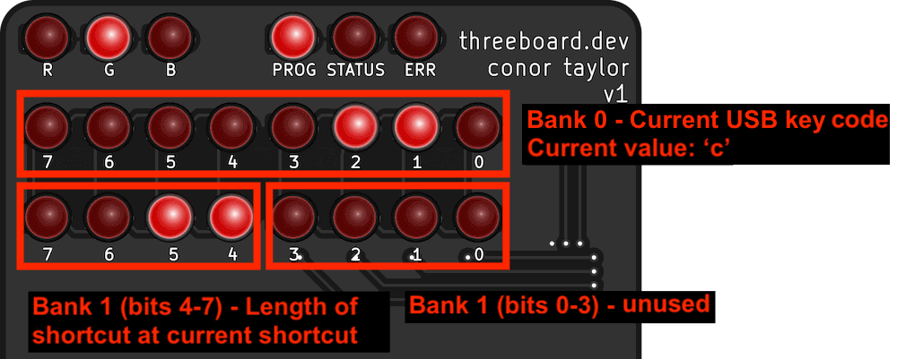
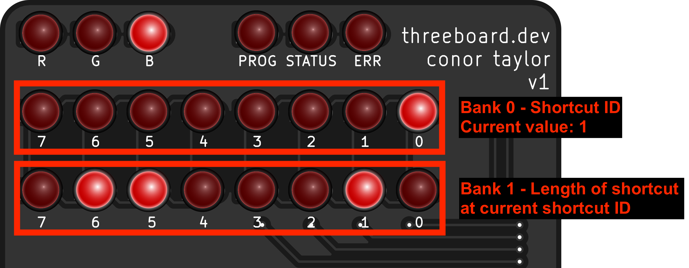
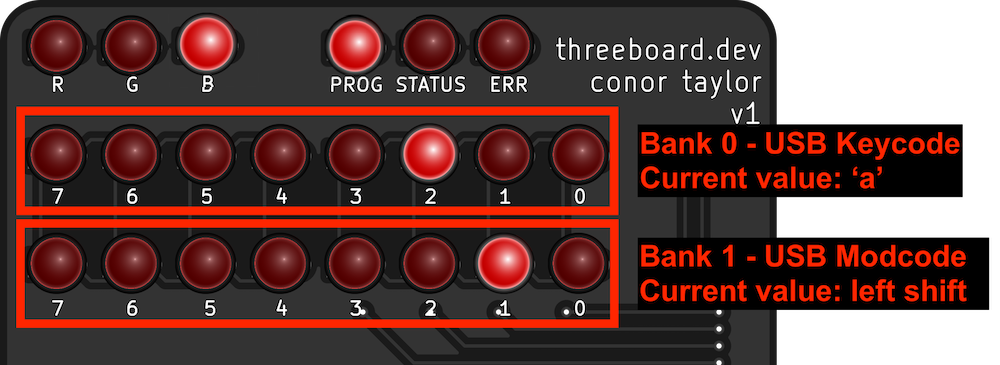
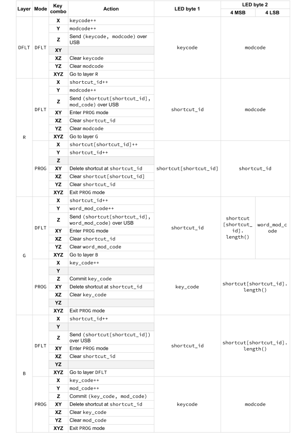

# threeboard user manual

This document explains all of the user functionality of the threeboard. See the [examples](#examples) section at the bottom of this document for usage examples.

## Overview
The threeboard uses three keys to select keycodes to send over USB, and also provides three programmable layers to store and retrieve key combinations. The state of the keyboard is visualised using the 22 onboard LED lights, and can only be modified using the three keys. The image below highlights the different features of the device:

  

1. 3 LEDs indicating the currently selected keyboard layer (R, G and B).
2. 3 status LEDs for indicating operating status of the threeboard (PROG, STATUS and ERR)
3. Bank0, a binary byte display of 8 LEDs. Used for displaying layer-specific information (e.g. displaying the USB keycode)
4. Bank1, another binary byte display with 8 LEDs. Used for displaying a different byte of layer-specific information (e.g. displaying the USB modifier code).
5. Mechanical key X.
6. Mechanical key Y.
7. Mechanical key Z.

## Layers and modes

The user-facing functionality is split into layers. A layer changes the functionality of each key on the threeboard, similar to a shift or function key on a traditional keyboard. The threeboard has four different layers: a default `DFLT` layer, and three programmable layers:

- `DFLT`: The default layer of the threeboard. This is the layer that the threeboard starts in when it boots. No layer LEDs are lit in this layer. This is a single character input layer, where characters and modifiers in this layer are identified by their USB key codes.
- `R`: The character reprogramming layer of the threeboard. This layer allows users to reassign a keycode to a character. This allows faster input of common characters.
- `G`: The word shortcut layer. This layer allows users to program frequently used words into the threeboard. These words can then be accessed and sent over USB.
- `B`: The blob shortcut layer. This allows users to program arbitrary text blobs (including mod codes), and access them later.

The three programmable layers each have two modes: `DFLT` and `PROG`:

- `DFLT`: This is the default mode of the programmable layers. It is used to retrieve shortcuts that were programmed in the `PROG` mode, and send them over USB.
- `PROG`: This mode is used for programming the shortcuts used in the DFLT mode of the layer.

Each layer and mode defines its own actions based on the input keypresses. Since there are many possible states, the full mapping of layers, modes, key combinations and actions is quite large, and is defined in the threeboard [usage table](#usage-table) section below. However most layers share some common actions for some keypresses:

- Key `X`: Increment bank 0.
- Key `Y`: Increment bank 1.
- Key `Z`: Send keypress(es) over USB (in `DFLT` mode), or store shortcut in `PROG` mode.
- Key combo `X`+`Z` (a.k.a. `XZ`): Clear bank 0.
- Key combo `YZ`: Clear bank 1.
- Key combo `XYZ`: Go to next layer (when in `DFLT` mode), or exit `PROG` mode otherwise.
- Key combo `XY`: Enter `PROG` mode (when in `DFLT` mode).

Brief examples of scenarios in each layer and mode configuration are visualised below:

### `DFLT` layer

  

In the `DFLT` layer, the byte in bank 0 represents the raw USB keycode value to be sent to the host computer, and bank 1 represents the USB modifier code. This layer has no `PROG` mode.

### Layer `R` - The character shortcut layer

  

Layer `R` is used for character reprogramming, which allows re-assigning a value of bank 0 to a different USB keycode than it represents in the `DFLT` layer. When this layer is being used in `DFLT` mode, bank 0 is used to identify the shortcut ID, and bank 1 is used as it is in the `DFLT` layer, to specify the USB modifier code.

  

In `PROG` mode, the current shortcut value at the specified shortcut ID is displayed in bank 0. The shortcut ID is instead displayed in bank 0.

### Layer `G` - The word shortcut layer

  

Layer `G` is used for word shortcut programming. Words up to 15 characters long can be stored per shortcut ID, and modifier codes are used to apply USB modifier codes to the word shortcut (such as capitalizing the first letter). In `DFLT` mode, bank 1 is split into two 4-bit indicators to display two different values; the 4 high bits are used to display the length of the current shortcut, and the 4 low bits display the word modification code. Word modification codes cause the following modifications:

- Code 0: Word is sent in lowercase.
- Code 1: Word is sent in uppercase.
- Code 2: The first letter of the word is capitalized.
- Code 3: A period (`.`) is appended to the end of the word.
- Code 4: A comma (`,`) is appended to the end of the word.
- Code 5: A hyphen (`-`) is appended to the end of the word.
- Codes 6-15: Reserved. The word is sent in lowercase.

  

In `PROG` mode, the current USB keycode to be appended to the word shortcut is displayed in bank 0. The 4 high bits of bank 1 continues to display the length of the word shortcut, but the 4 low bits are unused and always set to 0.

### Layer `B` - The blob shortcut layer

  

Layer `B` allows for freeform blob shortcut programming. Blobs of up to 255 keycode and modcode pairs can be stored. In `DFLT` mode, bank 0 displays the current shortcut ID, and bank 1 displays the length of the shortcut stored there.

  

In `PROG` mode, bank 0 displays the USB keycode being programmed, and bank 1 displays the modcode.

## Usage table

This table defines the full list of key combinations and their associated actions on each layer:

## Examples

This section contains a list of verbose examples to help understand how the key combinations can be used in practice.

### `DFLT` layer
Typing `Hello` from the `DFLT` layer:

1. Enter the `DFLT` layer. This is the layer the threeboard boots into, identified by none of the `R`, `G` or `B` LEDs being lit.
2. Select the `h` keycode in Bank 0 by pressing key `X` 11 times.
3. Set the `shift` modcode (to capitalise `h`) in Bank 1 by pressing key `Y` twice.
4. Send `H` to the computer over USB by pressing `Z`.
5. Reset Bank 0 by pressing `XZ`, and reset Bank 1 by pressing `YZ`.
6. Select `e` in Bank 0 by pressing `X` 8 times, then send it by pressing `Z`.
7. Select `l` in Bank 0 by pressing `X` an additional 7 times.
8. Send `l` over USB twice by pressing `Z` twice.
9. Select `o` by pressing `X` another 3 times, and send it by pressing `Z`.

### Layer `R`
Programming `a`, `b`, and `c` into shortcuts 0, 1 and 2 of layer `R`:

1. Enter layer `R` by pressing `XYZ` from the `DFLT` layer. The `R` LED should now be lit.
2. Enter `PROG` mode by pressing `XY`, the `PROG` LED should light up.
3. Set shortcut 0 to `a` by pressing `X` 4 times.
4. Switch to shortcut 1 by pressing `Y`.
5. Set shortcut 1 to `b` by pressing `X` 5 times.
6. Switch to shortcut 2 by pressing `Y`.
7. Set shortcut 2 to `c` by pressing `X` 6 times.

### Layer `G`
Programming `hello` into shortcut 0 of layer `G`:

1. Enter layer `G` by pressing `XYZ` twice from the `DFLT` layer. The `G` LED should be lit now.
2. Enter `PROG` mode by pressing `XY`.
3. Select the `h` keycode in Bank 0 by pressing key `X` 11 times.
4. Append `h` to shortcut 0 by pressing `Z`.
5. Clear Bank 0 by pressing `XZ`.
6. Select `e` in Bank 0 by pressing `X` 8 times, and append it to shortcut 0 by pressing `Z`.
7. Press `X` another 7 times to select `l`, and append it twice to shortcut 0 by pressing `Z` twice.
8. Select `o` by pressing `X` an additional 3 times, and append it by pressing `Z`.

Send `Hello` over USB from stored `hello` in shortcut 0:

1. Enter layer `G`, shortcut 0.
2. Select the 'uppercase' modcode, indicated by a value of 1 in Bank 1, by pressing `Y`.
3. Press `Z` to send `Hello` (with first letter capitalised) over USB.

### Layer `B`
Programming `Hi!` into shortcut 0 of layer `B`:

1. Enter layer `B` by pressing `XYZ` three times from the `DFLT` layer, lighting the `B` LED.
2. Enter `PROG` mode by pressing `XY`.
3. Append `H` to shortcut 0 by setting Bank 0 to `h` (pressing `X` 11 times) and Bank 1 to shift (pressing `Y` twice), and append by pressing `Z`.
4. Clear Bank 1 by pressing `YZ`.
5. Select `i` in Bank 0 by pressing `X`, and append it to shortcut 0 by pressing `Z`.
6. Select `1` in Bank 0 by pressing `X` another 18 times.
7. Set Bank 1 to shift (pressing `Y` twice), and append by pressing `Z`.